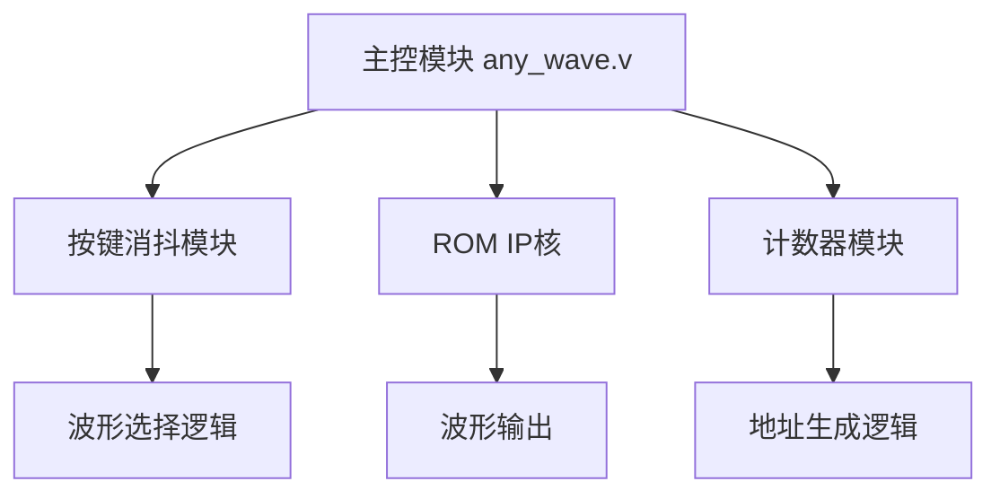
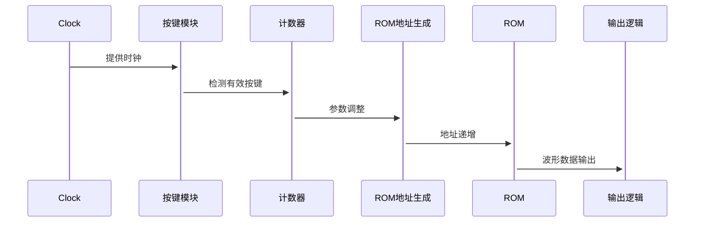

# 可变参数波形发生器设计

## 一、功能要求

1. **波形生成功能**  
   至少生成4种波形：正弦波、方波、锯齿波、三角波。
2. **按键参数设置**  
   通过按键设置波形类型及基本参数（幅度、频率等）。
3. **参数取值范围**  
   每个参数至少4种取值，参数种类≥2（如幅度、频率）。
4. **串口设置功能（选做）**  
   通过自定义串口协议设置波形参数。

---

## 二、总体设计思路

### 系统框架



### 模块关系

- **输入信号**：`clk`, `rst_n`, `key1`, `key2`, `key3`
- **输出信号**：`dout[7:0]`
- **核心模块**：
  - `any_wave.v`：主控模块，协调各子模块
  - `key_negedge.v`：按键下降沿检测（替代消抖模块）
  - `count.v`：按键次数计数器
  - ROM IP核：存储4种波形数据

### 时序关系



---

## 三、设计步骤

### 1. 输入输出分析

- **输入**：
  - `clk`：100MHz时钟
  - `rst_n`：异步复位
  - `key1`：波形选择
  - `key2`：幅度调节
  - `key3`：频率调节
- **输出**：`dout[7:0]`：8位波形数据

### 2. 关键技术方案

- **按键处理**：使用`key_negedge`检测有效按键
- **参数调节**：
  - **幅度**：通过右移操作（`>>`）实现2倍步进
  - **频率**：控制ROM地址递增步长
- **波形存储**：4个独立ROM IP核存储波形数据

### 3. 模块实现

#### (1) 主控模块 `any_wave.v`

```verilog
module any_wave(
    input clk,
    input key1, key2, key3,
    input rst_n,
    output [7:0] dout
);
// 波形选择逻辑
always @(posedge clk) begin
    case(count_key1)
        0: dout_temp1 <= sin_wave;
        1: dout_temp1 <= square_wave;
        // ...其他波形
    endcase
end

// 幅度调节
assign dout = dout_temp1 >> count_key2;

// 频率调节
always @(posedge clk) begin
    address <= address + count_key3;
end
endmodule
```

#### (2) 按键检测 `key_negedge.v`

```verilog
module key_negedge(
    input clk, key, rst_n,
    output reg q
);
// 两级寄存器消抖
always @(posedge clk) begin
    def2 <= def1;
    def1 <= key;
    q <= (def1 && !def2);
end
endmodule
```

#### (3) 计数器 `count.v`

```verilog
module count(
    input clk, rst_n, en, clr,
    output reg [3:0] data,
    output reg t
);
always @(posedge clk) begin
    if(en && !clr) begin
        if(data == 4'd3) data <= 0;
        else data <= data + 1;
    end
end
endmodule
```

---

## 四、关键问题与解决

| 问题描述 | 解决方案 |
|---------|----------|
| 按键抖动影响参数设置 | 采用两级寄存器实现简易消抖 |
| 幅度调节导致数据溢出 | 使用右移代替乘法，限制幅度范围 |
| Modelsim无法读取mif文件 | 添加convert_hex2ver.dll插件 |
| 仿真波形显示HiZ/StX | 统一数据位宽，避免未初始化信号 |

---

## 五、仿真验证

### 测试激励 (`any_wave.vt`)

```verilog
`timescale 1ps/1ps
module any_wave_vlg_tst();
    // 时钟生成
    always #10 clk = ~clk;
    
    initial begin
        clk = 0; rst_n = 0;
        #100 rst_n = 1;
        // 周期触发按键
        forever begin
            #400000 key1 = ~key1;
            #200000 key2 = ~key2;
            #100000 key3 = ~key3;
        end
    end
endmodule
```

### 仿真结果分析

- **波形切换**：key1每400ns触发，循环切换4种波形
- **幅度调节**：key2每200ns触发，实现1/2幅度调节
- **频率调节**：key3每100ns触发，地址步长增加

---

## 六、心得体会

1. **模块化设计**：将按键检测、参数计数、波形生成解耦，提高可维护性
2. **资源优化**：使用移位代替乘除，节省逻辑资源
3. **仿真调试**：通过Modelsim波形分析快速定位时序问题
4. **工程实践**：掌握Quartus+Modelsim联合开发流程

> **注意事项**:
> - 实际硬件实现时需考虑按键消抖时间常数
> - 高频时钟下需优化地址生成逻辑时序
> - ROM初始化文件需严格校验数据范围
